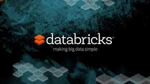
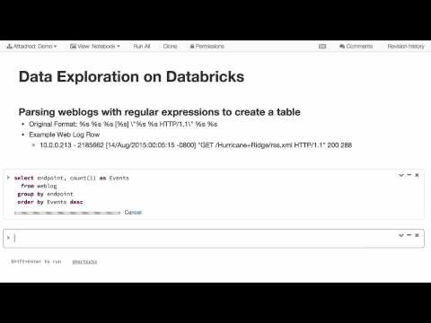
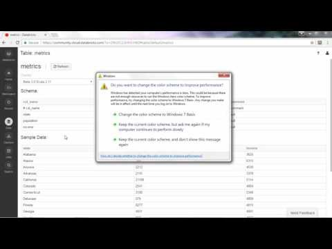

# Challenge 2: Deploy Spark in Databricks Community Edition

In this challenge you will create an account at [Databricks](https://databricks.com/) and deploy an Apache Spark instance in cluster mode. Databricks was founded by the same team who created Apache Spark. They provide a series of solutions to satisfy the data needs by businesses, data scientists, data engineers, and education. Their [SparkHub](https://sparkhub.databricks.com) is a cool community that provides various resources for Spark developers and data engineers.

## Objectives

* Register an account at Databricks.
* Deploy an Apache Spark instance in the Databricks Community website.
* Explore what you can do with Databricks Spark instance.

## Step 1: Learn About Databricks

Watch the following video to have a general understanding what you can do with Databricks.

**Introduction to Databricks**

[](https://www.youtube.com/watch?v=WaxMj5_SLUI)

## Step 2: Register Databricks Account

In order to use the Databricks service, you need to create a community account. Go to [community.cloud.databricks.com/](https://community.cloud.databricks.com/) and click *Sign Up*. Follow the instructions to create your account and activate it in the verification email they send you.

## Step 3: Create Spark Instance

1. After creating your Databricks account and logging in, you will enter your account home. There is a vertical menu on the left and one of the menu item is *Clusters*. Click it.

1. Now you'll see a list of your available Apache Spark clusters. But so far you haven't created one. So click *Create Cluster*.

1. In the New Cluster page, enter a cluster name, choose the Runtime Version (any of the versions in the dropdown list should work but you can choose newer versions that are not *Beta*). Select Python version 3 (consistent with the version we use in this course), then click *Create Cluster*.

1. It takes a minute or two for the new cluster to finish deployment. Once the deployment is finished, you will see it in the *Interactive Clusters* list whose state should be *Running*.
	* If you're done working with the cluster, you can terminate the cluster.
	* You can also restart or clone the cluster.
	* If you have a community account and your Databricks cluster is idling for over 2 hours, Databricks will automatically terminate your cluster in order to recycle technical resources. If that happens, you just need to re-deploy a new cluster.

## Step 4: Test Your Spark Instance in Jupyter Notebook

1. Now click the *databricks* icon in the nav menu to go back to the welcome page. Create a new Jupyter Notebook in the *Common Tasks*.

1. You will see a very familiar web interface that is identical to the vanilla Jupyter Notebook we installed from open source. However, there are slight differences than the vanilla Jupyter Notebook.

1. Let's benchmark the `estimate_pi` function we used in Challenge 1. See how many seconds does Databricks Notebook take to complete.

	```python
	import numpy as np
	from timeit import default_timer as timer

	def inside(p):
	    """
	    Generate a random point and check if the point is within the circle with radius=1.
	    
	    Returns:
	        (bool) whether the generated point is within the circle area
	    """
	    x, y = np.random.random(), np.random.random()
	    return x*x + y*y < 1

	def estimate_pi(num_samples):
	    """
	    Estimate the value of Pi by means of repeated sampling. Benchmark the repeated sampling time cost.
	    
	    Params:
	        num_sampes (int): the number of sample points to generate
	    
	    Returns:
	        (float) estimated value of Pi
	    """
	    print("Executing Spark job...")
	    start = timer()
	    dots = list(filter(inside,list(range(num_samples)))) 
	    count = len(dots)
	    end = timer()
	    print("Spark job ended. Total time elapsed: %s" % (end-start))
	    return(4.0 * count / num_samples)

    estimate_pi(5000000)
    ```

1. Now let's benchmark the `estimate_pi_parallel` function you wrote in Challenge 1. Note that in the Databricks Notebook, `SparkContext` class is not available. However, there is a `SparkSession` instance called `spark` you can use. `spark.sparkContext.parallelize` is the way you can do parallel programming.

1. After you're done, you can publish your Databricks notebook by clicking the *Publish* button on the top right.
Here is an [example of the published notebook on Estimate Pi Test](https://databricks-prod-cloudfront.cloud.databricks.com/public/4027ec902e239c93eaaa8714f173bcfc/1703412207731938/2169070836696660/7635369984325857/latest.html) published on Databricks.

## Step 5: Learn More About What You can Do With Databricks

Watch the following video tutorials on how to use Databricks. Follow each video and try it out with your Databricks Notebook.

### Data Exploration with Databricks

[](https://www.youtube.com/watch?v=mPTzJDs0EkI)

* How to load internal datasets in Databricks Notebook

* How to visualize data in Databricks Notebook

### Upload Flat File to Databricks Table

[](https://www.youtube.com/watch?v=H5LxjaJgpSk)

* Upload data files to Databricks

* Create table from uploaded data files

* Use Spark SQL to query data

## Summary

Databricks is an extremely cool product which provides the complete solution for learning, development, and production. Unfortunately, the Databricks Community Edition has very limited features. With a paid Databricks plan, there are lots of more powerful features you can use such as:

* [Connect BI tools (e.g. Tableau) to Spark server using JDBC/ODBC driver](https://docs.databricks.com/user-guide/bi/jdbc-odbc-bi.html).

* [Schedule Jupyter Notebook execution jobs](https://docs.databricks.com/user-guide/jobs.html).

* [Team collaboration](https://www.youtube.com/watch?v=etKTJTxaad0).

* [Establishing an end-to-end ML data pipeline](https://www.youtube.com/watch?v=NR1MYg_7oSg).

If you feel you want to use Databricks in your final project, you may consider starting a 14-day trial for Databricks so that you can use its advanced features.
